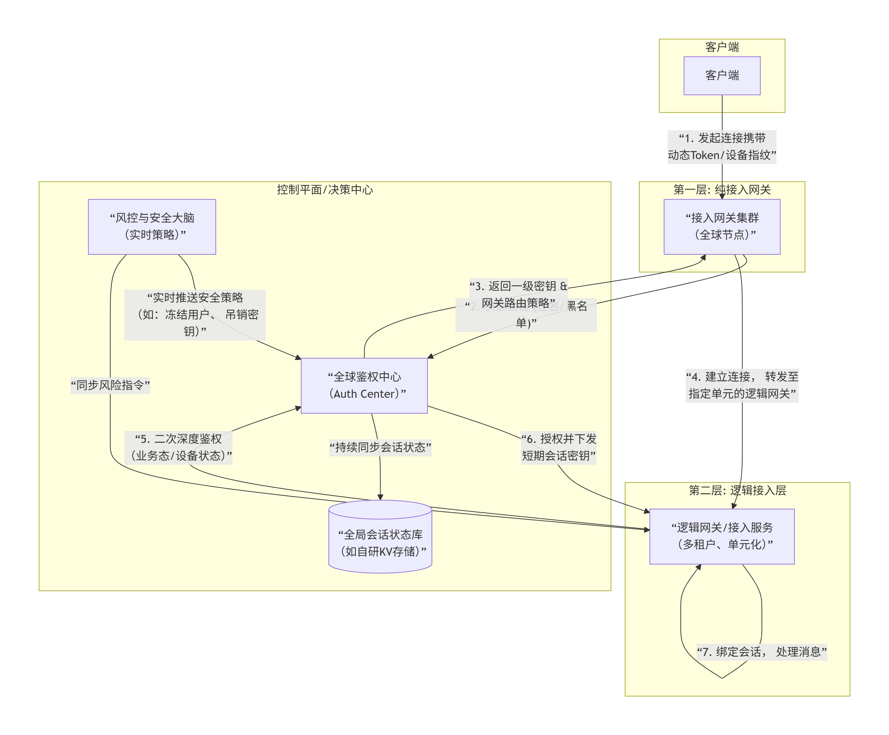

# IM鉴权详解

在微信、钉钉这类亿级用户的IM平台中，它们的鉴权体系是一个高度复杂、多层防御、动态调整的安全工程系统，远超简单的“验证Token”概念。它们在您提到的两层网关架构上，将鉴权逻辑深度拆解并嵌入到了通信流程的每一个环节。

核心思想是：“连接可信”不等于“消息可信”。因此，它们会建立多层信任链，并且让信任状态可实时撤销。下图揭示了这一多层级、可实时干预的鉴权系统是如何运作的：

## 分层鉴权详解：大型平台的实践

### 第一层：纯接入网关 —— “快速安检门”

1. 目的：以最小开销过滤掉大部分非法流量（DDoS、扫描器、无效连接），不进行复杂业务鉴权。

2. 动作：
   - 令牌预检：检查连接请求中Token的基本格式和签名，通过则认为是“可处理的请求”。
   - 风险IP/设备拦截：根据接入网关本地缓存的全局黑名单，直接拦截已知恶意IP或设备指纹。
   - 负载均衡与路由：根据用户ID或Token，通过一致性哈希等算法，将连接路由到第二层特定的、服务该用户“单元”的逻辑网关。这一步就决定了用户后续所有请求的去向。

3. 关键点：此时并不完全信任用户身份，只是允许连接进入系统，并将其引导到正确的“业务办理窗口”。

### 第二层：逻辑网关/接入服务 —— “身份验证与业务受理大厅”

这是鉴权的核心层，在这里完成真正的身份确认和会话建立。

1. 深度身份验证：
   - 调用后端的统一鉴权中心，校验Token的完整有效性（是否过期、是否被吊销、是否与设备绑定）。
   - 验证用户的全局状态（是否被封禁、是否在异常地点登录）。

2. 建立安全会话：
   - 验证通过后，鉴权中心会生成一个短期有效的会话密钥和会话ID。这个会话密钥仅对该次连接有效，并与用户ID、设备信息、连接网关ID强绑定。
   - 逻辑网关将这套会话信息保存在全局高性能存储中（如优化的Redis集群或自研KV存储）。

3. 消息级安全：
   - 此后，客户端发送的每一条业务消息，都必须用会话密钥对消息内容（或序列号+时间戳）生成一个消息验证码。
   - 逻辑网关收到每条消息时，都会从存储中取出会话密钥，重新计算验证码进行比对。这是防止连接劫持后消息被篡改或伪造的关键。

## 高级实践与核心差异

大型平台与普通方案的差异在于动态性、全局性和实时干预能力：

1. 动态密钥与滚动更新：会话密钥会定期或在关键操作后滚动更新。即使被窃取，攻击窗口期也极短。

2. 设备指纹与绑定：鉴权不仅认“人”（用户ID），更认“设备”。会采集设备硬件、网络、行为特征生成指纹。异常设备登录会触发二次验证。

3. 全局实时风控干预：风控系统可以随时向全网的逻辑网关和接入网关广播指令，要求立即吊销某个用户的会话。网关收到指令后，会主动断开用户连接或拒绝其消息。

4. 单元化与隔离：用户被划分到不同的“单元”。一个单元的服务故障或安全事件，不会扩散到其他单元，实现了故障和风险的隔离。

## 总结

大型IM平台的鉴权不是一个“点”，而是一个从连接、到会话、到每条消息、并受中央风控实时调控的“立体网络”。理解这个分层、动态的思想，远比复制某个具体技术点更重要，您可以根据自身业务的安全需求，在这个光谱上找到最适合的落地方案。

